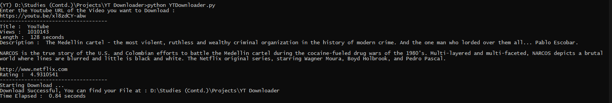

# Youtube-Downloader

Download Video &amp; Audio Files from Youtube using Python.

## About

It is a Simple YouTube Downloader which takes in input of the URL of the YouTube Video from the user and Downloads the same in your device.

## Output

Demo:

All the section wise output files according to sections are in `/output`.

## Dependencies 

Install the dependencies from your terminal with -

`pip install -r requirements.txt`

## Dependencies 

Run the Downloader from your terminal with -

`python YTDownloader.py`

## Next Updates 

| 1. CLI-Integration |
|--------------------|
| 2. Tkinter Build   |

NOTE : CLI Integration will directly imported to my PyPI Library [R-07.](https://pypi.org/project/R07)

## Contributing 

If you are the helping and contributing one, your efforts and suggestion are always welcomed.

## Donations

[Donate in Patreon](https://patreon.com/rahulbordoloi)  

  <a class="donate-with-crypto"
     href="https://commerce.coinbase.com/checkout/c2be6faa-ef33-40ea-9a18-6054fe6d75a0">
    Donate with Crypto
  </a>

